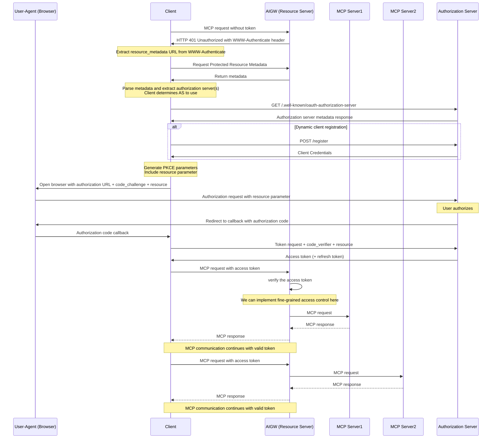

## AIGW mcp authentication demo

This demo shows how AIGW helps an MCP server that does not support OAuth2 to authenticate with an OAuth2 Authorization Server (AS) using the OAuth2 Authorization Code Flow defined in the [MCP Authorizationspecification](https://modelcontextprotocol.io/specification/2025-06-18/basic/authorization).

This can be useful when you have a mcp server that provides sensitive data or actions, and you want to restrict access to authorized users only. The authentication is offloaded to AIGW, which acts as a proxy between the agent and the mcp server, and you don't need to modify the mcp server itself.


## Set up a local Keycloak as the Auth server

AIGW can work with any auth server that supports the auth code flow. This demo runs a local keycloak server in a docker container.

```bash
docker run --rm -it --name mykeycloak \
  -p 127.0.0.1:8080:8080 \
  -e KC_BOOTSTRAP_ADMIN_USERNAME=admin \
  -e KC_BOOTSTRAP_ADMIN_PASSWORD=change_me \
  -v $(pwd)/trusted-hosts-policy.json:/opt/keycloak/data/import/trusted-hosts-policy.json \
  quay.io/keycloak/keycloak:latest start-dev
```

Log in to the admin console at http://localhost:8080 and delete the Trusted Hosts policy for client registration. This enables dynamic client registration from localhost.

⚠️ Note: This is insecure and should only be used for local testing. In production, configure a proper Trusted Hosts policy that matches your environment.

## Run the MCP Gateway with configuration that uses Keycloak for OAuth2:

Follow the installation instructions in the [AIGW documentation](https://aigateway.envoyproxy.io/docs/cli/aigwinstall/) to install AIGW.

Run the MCP gateway with the provided configuration:

```
$ aigw run mcp_oauth_keycloak.yaml
```

Then, add the MCP gateway to Claude:

```
claude mcp add -t http mcp-gateway http://127.0.0.1:1975/mcp
```

Open it inside Claude:

```
/mcp mcp-gateway
```

When prompted, click Authentication. You’ll see output like:

```
> /mcp mcp-gateway

Authenticating with mcp-gateway…

·  A browser window will open for authentication

If your browser doesn't open automatically, copy this URL manually:
http://localhost:8080/realms/master/protocol/openid-connect/auth?response_type=code&client_id=d73a6849-2fc3-4a3e-8035-5ccbded52be2&code_challenge=BCVyqS1thrzTUAc7_Dz_B-ZXKPXMzvj4zrpowuhJP_M
&code_challenge_method=S256&redirect_uri=http%3A%2F%2Flocalhost%3A64442%2Fcallback&state=EpHCh4LIqmnwE3goyNPw1HNxv5yEZtArudQwRRaMr4A&resource=http%3A%2F%2F127.0.0.1%3A1975%2Fmcp

   Return here after authenticating in your browser. Press Esc to go back.
```

A browser window opens with the Keycloak login page.
Log in using the credentials you set (admin / change_me in this example).

Once authenticated, Claude will confirm:

```
> /mcp mcp-gateway
  ⎿  Authentication successful. Connected to mcp-gateway.
```

Now you can explore the available tools:

```
> /mcp
╭────────────────────────────────────────────────────────────────────╮
│ Tools for mcp-gateway (11 tools)                                   │
│                                                                    │
│ ❯ 3. context7__resolve-library-id                                  │
│   4. context7__get-library-doc                                     │
│   5. kiwi__search-flight                                           |
|   6. kiwi__feedback-to-devs                                        │
╰────────────────────────────────────────────────────────────────────╯
   Esc to go back
```

From here, you can start using the tools inside Claude.

In the example below, we use the flight search tool to find flights from Los Angeles to San Francisco.

```bash
> Find the best flights from LA to SF on this Friday.

⏺ I'll search for flights from Los Angeles to San Francisco this Friday (October 10, 2025).

⏺ mcp-gateway - kiwi__search-flight (MCP)(flyFrom: "Los Angeles", flyTo: "San Francisco", departureDate: "10/10/2025", cabinClass: "M", curr: "USD", locale: "en", sort: "price")
  ⎿  [
       {
         "flyFrom": "LAX",
     … +284 lines (ctrl+o to expand)

⏺ Best Flights from Los Angeles to San Francisco - Friday, October 10, 2025

  Cheapest Options

  | Route     | Departure → Arrival          | Class   | Price | Book                       |
  |-----------|------------------------------|---------|-------|----------------------------|
  | LAX → SFO | 10/10 21:30 → 22:56 (1h 26m) | Economy | $133  | https://on.kiwi.com/Yl8Tzg |
  | LAX → SFO | 10/10 18:47 → 20:28 (1h 41m) | Economy | $138  | https://on.kiwi.com/KT16R0 |
  | LAX → SFO | 10/10 17:30 → 19:12 (1h 42m) | Economy | $157  | https://on.kiwi.com/0q5sEP |

  Shortest Flights

  | Route     | Departure → Arrival          | Class   | Price | Book                       |
  |-----------|------------------------------|---------|-------|----------------------------|
  | LAX → SFO | 10/10 19:45 → 21:07 (1h 22m) | Economy | $183  | https://on.kiwi.com/C9naT5 |
  | LAX → SFO | 10/10 06:00 → 07:25 (1h 25m) | Economy | $175  | https://on.kiwi.com/HLfnjw |
  | LAX → SFO | 10/10 21:30 → 22:56 (1h 26m) | Economy | $133  | https://on.kiwi.com/Yl8Tzg |

  Other Options Worth Considering

  | Route     | Departure → Arrival          | Class   | Price | Book                       |
  |-----------|------------------------------|---------|-------|----------------------------|
  | LAX → SFO | 10/10 22:30 → 23:58 (1h 28m) | Economy | $185  | https://on.kiwi.com/17Tpve |
  | LAX → SFO | 10/10 16:10 → 17:37 (1h 27m) | Economy | $207  | https://on.kiwi.com/aBz6DO |
  | LAX → SFO | 10/10 13:35 → 15:02 (1h 27m) | Economy | $207  | https://on.kiwi.com/gKmZo8 |

  Recommendation: The 9:30 PM flight for $133 offers the best value - it's both the cheapest and one of the shortest flights. If you prefer an earlier departure, the 6:00 AM
  flight for $175 is an excellent option with a short 1h 25m duration.

  Have a great trip to San Francisco! Fun fact: The flight distance between LAX and SFO is only about 337 miles, making it one of the busiest air routes in the United States
  with over 7 million passengers annually.
```

## Under the hood

The following sequence diagram illustrates the OAuth2 authentication flow between the User-Agent (Browser), Client (Claude), MCP Gateway (AIGW), MCP Server, and Authorization Server (Keycloak).


