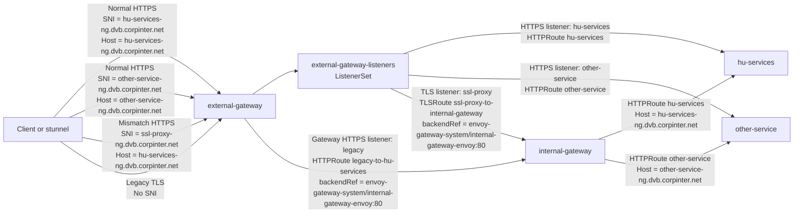

# Two Gateway SNI/Host Mismatch

This cookbook shows two traffic patterns on the same external Gateway.

- Normal traffic uses one Gateway hop when TLS SNI and the HTTP `Host` header both match the application hostname.
- Mismatch traffic uses two Gateway hops when TLS SNI is `ssl-proxy-ng.dvb.corpinter.net` but the HTTP `Host` header is an application hostname. The external Gateway gets its traffic listeners from a `ListenerSet`, terminates TLS on a `TLS` listener, then a `TLSRoute` forwards the decrypted stream to the internal HTTP Gateway for Host-based routing.
- Legacy clients that do not send SNI can fall back to the base `legacy` HTTPS listener on `external-gateway` and route through the same internal HTTP Gateway.



## Prerequisites

- Envoy Gateway is installed.
- Gateway API CRDs are installed.
- The `ListenerSet` API is installed and enabled in Envoy Gateway.
- The current Kubernetes context points to the test cluster.
- The example creates Gateway, Route, backend, Secret, and policy resources in the `default` namespace.
- The internal Gateway Envoy Service is fixed as `envoy-gateway-system/internal-gateway-envoy`.

## Deploy Test Backends

Create two simple echo services that match the backend names in `example.yaml`:

```bash
kubectl create deployment hu-services -n default \
  --image=gcr.io/k8s-staging-gateway-api/echo-basic:v20231214-v1.0.0-140-gf544a46e
kubectl expose deployment hu-services -n default --port=3000 --target-port=3000

kubectl create deployment other-service -n default \
  --image=gcr.io/k8s-staging-gateway-api/echo-basic:v20231214-v1.0.0-140-gf544a46e
kubectl expose deployment other-service -n default --port=3000 --target-port=3000
```

## Generate Listener Certificates

Generate one local CA:

```bash
openssl genrsa -out ca.key 4096
openssl req -x509 -new -nodes -key ca.key -sha256 -days 3650 -out ca.crt -subj "/CN=example-gateway-ca"
```

Generate and install the `ssl-proxy-ng.dvb.corpinter.net` listener certificate:

```bash
HOST=ssl-proxy-ng.dvb.corpinter.net
openssl genrsa -out ${HOST}.key 2048
openssl req -new -key ${HOST}.key -out ${HOST}.csr -subj "/CN=${HOST}"
printf "subjectAltName = DNS:${HOST}\nkeyUsage = digitalSignature, keyEncipherment\nextendedKeyUsage = serverAuth\n" > ${HOST}.ext
openssl x509 -req -in ${HOST}.csr -CA ca.crt -CAkey ca.key -CAcreateserial -out ${HOST}.crt -days 825 -sha256 -extfile ${HOST}.ext
kubectl create secret tls ssl-proxy-ng-cert -n default --cert=${HOST}.crt --key=${HOST}.key
```

Generate and install the normal app listener certificate:

```bash
HOST=hu-services-ng.dvb.corpinter.net
openssl genrsa -out ${HOST}.key 2048
openssl req -new -key ${HOST}.key -out ${HOST}.csr -subj "/CN=${HOST}"
printf "subjectAltName = DNS:${HOST}\nkeyUsage = digitalSignature, keyEncipherment\nextendedKeyUsage = serverAuth\n" > ${HOST}.ext
openssl x509 -req -in ${HOST}.csr -CA ca.crt -CAkey ca.key -CAcreateserial -out ${HOST}.crt -days 825 -sha256 -extfile ${HOST}.ext
kubectl create secret tls hu-services-ng-cert -n default --cert=${HOST}.crt --key=${HOST}.key
```

Generate and install the second normal app listener certificate:

```bash
HOST=other-service-ng.dvb.corpinter.net
openssl genrsa -out ${HOST}.key 2048
openssl req -new -key ${HOST}.key -out ${HOST}.csr -subj "/CN=${HOST}"
printf "subjectAltName = DNS:${HOST}\nkeyUsage = digitalSignature, keyEncipherment\nextendedKeyUsage = serverAuth\n" > ${HOST}.ext
openssl x509 -req -in ${HOST}.csr -CA ca.crt -CAkey ca.key -CAcreateserial -out ${HOST}.crt -days 825 -sha256 -extfile ${HOST}.ext
kubectl create secret tls other-service-ng-cert -n default --cert=${HOST}.crt --key=${HOST}.key
```

Generate and install the fallback listener certificate for clients that do not send SNI:

```bash
HOST=legacy.dvb.corpinter.net
openssl genrsa -out ${HOST}.key 2048
openssl req -new -key ${HOST}.key -out ${HOST}.csr -subj "/CN=${HOST}"
printf "subjectAltName = DNS:${HOST}\nkeyUsage = digitalSignature, keyEncipherment\nextendedKeyUsage = serverAuth\n" > ${HOST}.ext
openssl x509 -req -in ${HOST}.csr -CA ca.crt -CAkey ca.key -CAcreateserial -out ${HOST}.crt -days 825 -sha256 -extfile ${HOST}.ext
kubectl create secret tls legacy-cert -n default --cert=${HOST}.crt --key=${HOST}.key
```

## Apply

The internal Gateway uses an `EnvoyProxy` configuration to make its generated Kubernetes Service name fixed:

```yaml
envoyService:
  name: internal-gateway-envoy
  type: ClusterIP
```

The external Gateway forwards mismatch traffic to that fixed Service name.
Because the Service lives in `envoy-gateway-system`, the manifest also creates a `ReferenceGrant` in `envoy-gateway-system` allowing the `default` namespace routes to reference it.

The external Gateway exposes these traffic listeners through `ListenerSet`:

- `ssl-proxy`: terminating `TLS` listener for the SNI/Host mismatch path.
- `hu-services`: terminating `HTTPS` listener for the normal direct path.
- `other-service`: terminating `HTTPS` listener for the second normal direct path.

The base Gateway also has a `legacy` HTTPS listener with no hostname. That listener is intentionally left on the Gateway so clients without SNI have a fallback certificate. It uses an `HTTPRoute`, because `TLSRoute` requires `spec.hostnames` and cannot represent a no-SNI fallback route.

```bash
kubectl apply -f example.yaml
```

## Verify

Get the external Gateway address:

```bash
GATEWAY_IP=$(kubectl get gateway external-gateway -n default -o jsonpath='{.status.addresses[0].value}')
```

Normal single-Gateway path:

```bash
curl -v --cacert ca.crt \
  --resolve hu-services-ng.dvb.corpinter.net:443:${GATEWAY_IP} \
  https://hu-services-ng.dvb.corpinter.net/
```

SNI/Host mismatch path:

```bash
curl -v --cacert ca.crt \
  --resolve ssl-proxy-ng.dvb.corpinter.net:443:${GATEWAY_IP} \
  -H "Host: hu-services-ng.dvb.corpinter.net" \
  https://ssl-proxy-ng.dvb.corpinter.net/
```

The normal path should return a response from `hu-services` through the external Gateway. The mismatch path should also return `hu-services`, but it reaches it through:

```text
client -> external-gateway TLS listener -> internal-gateway HTTP listener -> hu-services
```

You can also verify the second internal Host route:

```bash
curl -v --cacert ca.crt \
  --resolve ssl-proxy-ng.dvb.corpinter.net:443:${GATEWAY_IP} \
  -H "Host: other-service-ng.dvb.corpinter.net" \
  https://ssl-proxy-ng.dvb.corpinter.net/
```

To verify the legacy no-SNI route, use `openssl s_client` with `-noservername` and send an HTTP request manually:

```bash
printf "GET / HTTP/1.1\r\nHost: hu-services-ng.dvb.corpinter.net\r\nConnection: close\r\n\r\n" | \
  openssl s_client -connect ${GATEWAY_IP}:443 -noservername -CAfile ca.crt -quiet
```

```bash
printf "GET / HTTP/1.1\r\nHost: other-service-ng.dvb.corpinter.net\r\nConnection: close\r\n\r\n" | \
  openssl s_client -connect ${GATEWAY_IP}:443 -noservername -CAfile ca.crt -quiet
```

## Inspect Status

Check that the Gateways and routes are accepted:

```bash
kubectl get gateway -n default
kubectl get listenerset -n default
kubectl get httproute,tlsroute -n default
kubectl describe tlsroute ssl-proxy-to-internal-gateway -n default
kubectl describe httproute legacy-to-hu-services -n default
kubectl describe httproute hu-services -n default
kubectl describe httproute other-service -n default
kubectl describe referencegrant allow-default-tlsroute-to-internal-gateway-envoy -n envoy-gateway-system
```

## Policy Placement

Attach `BackendTrafficPolicy` to the shared `HTTPRoute` that sends traffic to the app backend. Because the same route is attached to both the normal external listener and the internal Gateway listener, one policy can cover both paths for that app route.

## Cleanup

```bash
kubectl delete -f example.yaml
kubectl delete deployment hu-services other-service -n default
kubectl delete service hu-services other-service -n default
kubectl delete secret ssl-proxy-ng-cert hu-services-ng-cert other-service-ng-cert legacy-cert -n default
```
